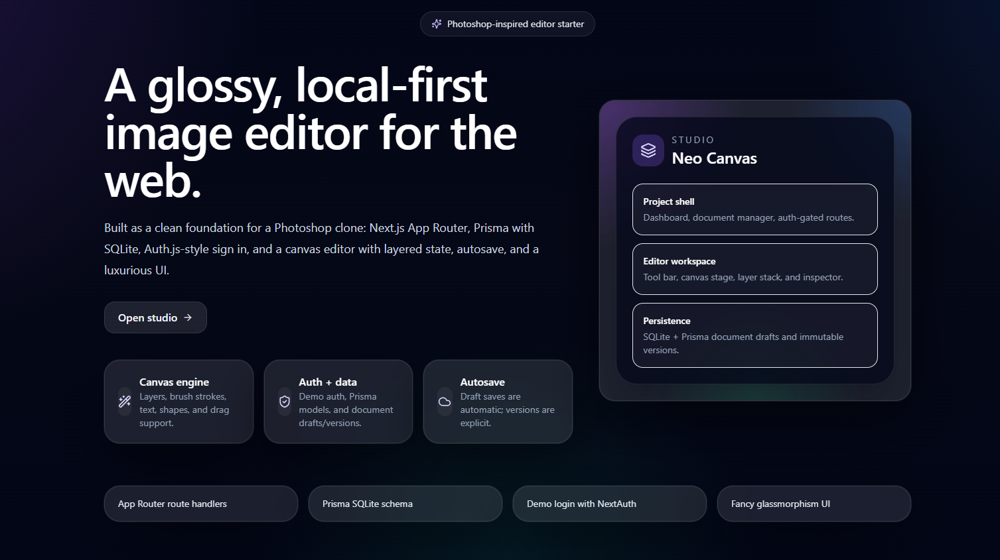
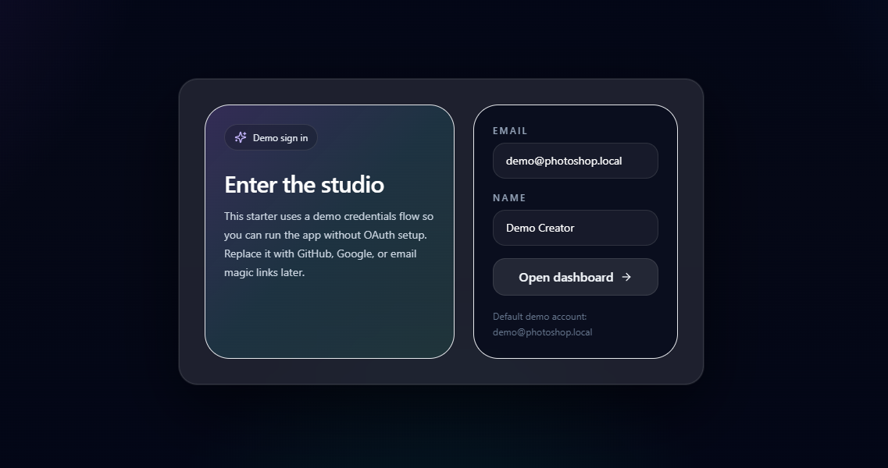
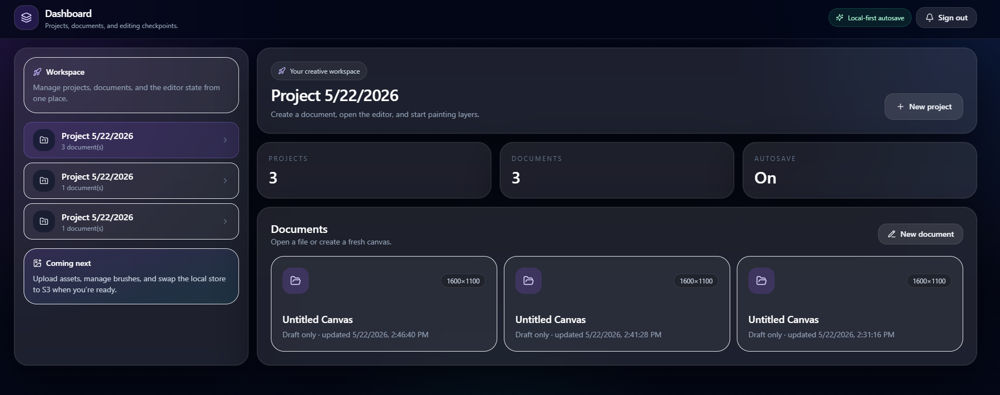
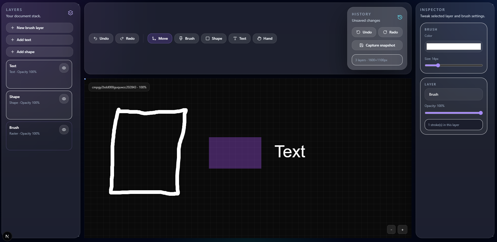

# Neo Canvas

A polished Photoshop-inspired starter built with:
- Next.js App Router
- Prisma + SQLite
- Auth.js / NextAuth v5-style auth
- A layered canvas editor UI

## Setup

1. Copy `.env.example` to `.env`
2. Set `AUTH_SECRET`
3. Install dependencies
4. Run Prisma and the app

```bash
npm install
npx prisma db push
npm run seed
npm run dev
```

## Notes

- The login page uses a demo credentials flow so the app works without OAuth secrets.
- Replace the credentials provider in `auth.ts` with GitHub/Google/email providers whenever you are ready.
- Route handlers live under `app/api/...`, which is the App Router convention.

## Showcase








